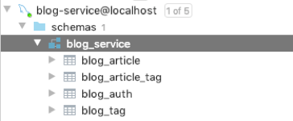
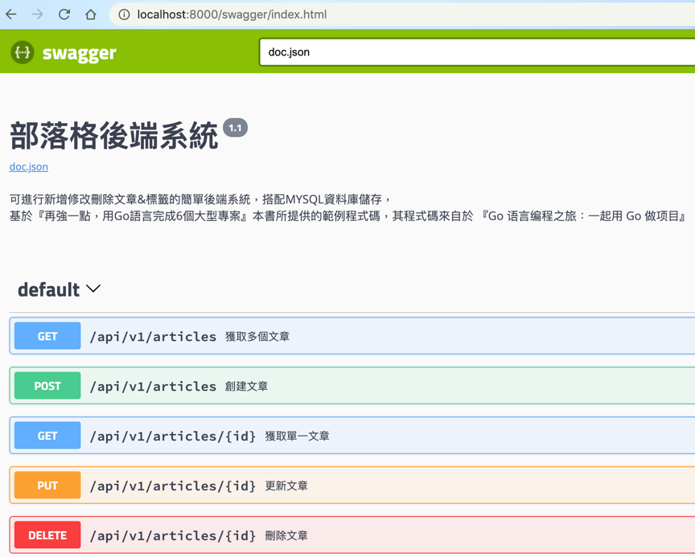

# 使用Golang + Gin + MySQL打造的部落格後端系統

本專案是基於 繁體中文書『再強一點，用Go語言完成6個大型專案』中的第二章節，所附的程式碼專案為主
為我針對該專案並搭配本書，進行系統架構分析與瀏覽，並瞭解Go專案中會使用到的工具會有哪些

## 使用到的工具

* [Gin](https://github.com/gin-gonic/gin): v1.6.3
  * 以Golang為主的後端框架
* [Swagger](https://github.com/swaggo/swag): v1.6.5
  * 根據OpenAPI標準，產生各種與介面相連結的工具

## 專案使用設定檔

放置在 `./configs/config.yaml`之下

```yaml
# 伺服器設定
Server:
  RunMode: debug
  HttpPort: 8000
  ReadTimeout: 60
  WriteTimeout: 60
# 後端設定
App:
  DefaultPageSize: 10
  MaxPageSize: 100
  DefaultContextTimeout: 60
  LogSavePath: storage/logs
  LogFileName: app
  LogFileExt: .log
  UploadSavePath: storage/uploads
  UploadServerUrl: http://127.0.0.1:8000/static
  UploadImageMaxSize: 5  # MB
  UploadImageAllowExts:
    - .jpg
    - .jpeg
    - .png
# Email伺服器設定
Email:
  Host: smtp.test.com
  Port: 465
  UserName: xxx
  Password: xxx
  IsSSL: true
  From: xxx
  To:
    - xxx
# JWT token設定
JWT:
  Secret: jwtsecret
  Issuer: blog-service
  Expire: 7200
# 資料庫設定
Database:
  DBType: mysql
  UserName: root
  Password: password
  Host: 127.0.0.1:3306
  DBName: blog_service
  TablePrefix: blog_
  Charset: utf8
  ParseTime: True
  MaxIdleConns: 10
  MaxOpenConns: 30
```

## 啟動方式

須事先安裝golang > 1.11 版本 (因為使用Go Module建立該專案)
以及MySQL資料庫做介接。

### 設定MYSQL資料庫

建議直接用Docker安裝
* Port: 3306
* 帳號: root (default)
* 密碼: password 

```shell script
docker run --name mysql -p 3306:3306 -e MYSQL_ROOT_PASSWORD=password -d mysql
```

請到MYSQL內，新增 `blog_service` 資料庫，以及在資料庫內運行本專案中的`/docs/sql/blog.sql` 
來新增所需要的table



### 啟動Golang專案

於專案根目錄底下，執行
```shell script
go run main.go
```

預設會在 port 8000啟動，成功運行的話會看到如下資訊，為GIN提供的API端口內容

```shell script
...
...
[GIN-debug] [WARNING] Running in "debug" mode. Switch to "release" mode in production.
 - using env:	export GIN_MODE=release
 - using code:	gin.SetMode(gin.ReleaseMode)

[GIN-debug] GET    /debug/vars               --> github.com/go-programming-tour-book/blog-service/internal/routers/api.Expvar (7 handlers)
[GIN-debug] GET    /swagger/*any             --> github.com/swaggo/gin-swagger.CustomWrapHandler.func1 (7 handlers)
[GIN-debug] POST   /upload/file              --> github.com/go-programming-tour-book/blog-service/internal/routers/api.Upload.UploadFile-fm (7 handlers)
[GIN-debug] POST   /auth                     --> github.com/go-programming-tour-book/blog-service/internal/routers/api.GetAuth (7 handlers)
[GIN-debug] GET    /static/*filepath         --> github.com/gin-gonic/gin.(*RouterGroup).createStaticHandler.func1 (7 handlers)
[GIN-debug] HEAD   /static/*filepath         --> github.com/gin-gonic/gin.(*RouterGroup).createStaticHandler.func1 (7 handlers)
[GIN-debug] POST   /api/v1/tags              --> github.com/go-programming-tour-book/blog-service/internal/routers/api/v1.Tag.Create-fm (7 handlers)
[GIN-debug] DELETE /api/v1/tags/:id          --> github.com/go-programming-tour-book/blog-service/internal/routers/api/v1.Tag.Delete-fm (7 handlers)
[GIN-debug] PUT    /api/v1/tags/:id          --> github.com/go-programming-tour-book/blog-service/internal/routers/api/v1.Tag.Update-fm (7 handlers)
[GIN-debug] GET    /api/v1/tags              --> github.com/go-programming-tour-book/blog-service/internal/routers/api/v1.Tag.List-fm (7 handlers)
[GIN-debug] POST   /api/v1/articles          --> github.com/go-programming-tour-book/blog-service/internal/routers/api/v1.Article.Create-fm (7 handlers)
[GIN-debug] DELETE /api/v1/articles/:id      --> github.com/go-programming-tour-book/blog-service/internal/routers/api/v1.Article.Delete-fm (7 handlers)
[GIN-debug] PUT    /api/v1/articles/:id      --> github.com/go-programming-tour-book/blog-service/internal/routers/api/v1.Article.Update-fm (7 handlers)
[GIN-debug] GET    /api/v1/articles/:id      --> github.com/go-programming-tour-book/blog-service/internal/routers/api/v1.Article.Get-fm (7 handlers)
[GIN-debug] GET    /api/v1/articles          --> github.com/go-programming-tour-book/blog-service/internal/routers/api/v1.Article.List-fm (7 handlers)
```

也可以透過下列參數調整專案啟動時的設定資訊

```shell script
go run main.go --port {啟動端口} --mode {啟動模式: 目前只能選debug} --config {指定要使用的配置文件路徑}
```

範例
```shell script
go run main.go --port 8888 --mode debug --config /configs/custom.yaml
```

### API Spec

本專案用Swagger來產生API文檔

可在專案目錄下，與`main.go`同一層中，用 `swag init`產生

```shell script
$ swag init
2020/11/07 18:11:38 Generate swagger docs....
2020/11/07 18:11:38 Generate general API Info, search dir:./
2020/11/07 18:11:40 Generating model.Article
2020/11/07 18:11:40 Generating model.Model
2020/11/07 18:11:40 Generating errcode.Error
2020/11/07 18:11:40 Generating model.ArticleSwagger
2020/11/07 18:11:40 Generating app.Pager
2020/11/07 18:11:40 Generating model.TagSwagger
2020/11/07 18:11:40 Generating model.Tag
2020/11/07 18:11:40 create docs.go at docs/docs.go
2020/11/07 18:11:40 create swagger.json at docs/swagger.json
2020/11/07 18:11:40 create swagger.yaml at docs/swagger.yaml
```

運行專案後，可檢視API文檔的網址如下：

```shell script
http://localhost:8000/swagger/index.html
```



<div style="
border-radius: 10px;
padding: 20px;
background-color: #FFF6C8;
color: black;
margin-bottom: 15px;
">
如果無法直接執行swag的話，請檢查 /go/bin 這個目錄是否有被加到環境變數內

詳情到該連結可查看：https://github.com/swaggo/swag/issues/209
</div>

